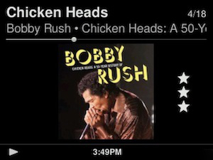
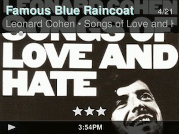

NowPlaying Ratings
====

A skin for jivelite that displays rating stars on the *Now Playing* screen of your **SB Radio**. Based on *QVGAlandscapeSkin*. 
⚠ Only for **SB Radio**.
  

[⬅️ **Back to the list of all plugins**](https://github.com/AF-1/)
   

## Features

- displays **rating stars on the Now Playing screen**

- **easy way to install and uninstall** the skin using an **installer applet** 

- colored track title if the track's comments tag contains a user-specified keyword 

 

Settings are here: **Settings > Screen > Now Playing**.
   

## Screenshots

  
  

   

## Installation

**First** you install the NowPlaying Ratings skin installer applet which you will **then** use to install the skin. 

#### #1 - Get the installer

- Make sure that your LMS and your device have internet access. 

- Go to **Settings > Advanced > Applet Installer**. 

- Select and install the **NowPlaying Ratings Installer**. 

- Your device will reboot automatically to complete the installation.  

#### #2 - Install the skin

- You should see a new menu item called **NowPlaying Ratings Installer**. 

- Follow the menu instructions. 

- Your device will reboot automatically.  

#### #3 - Enable the new skin

- Go to **Settings > Screen > Select skin** to enable the NowPlaying Ratings Skin.

- Read the FAQ on this page.

   

## Updating to a newer version

- ⚠ **Uninstall the old version first**.

- Then install the latest version.

   

## Uninstalling the skin

- Enable a *different* skin first.

- Go to **Settings > Advanced > Uninstall NowPlaying Ratings Skin** and follow the menu instructions. 

- Your device will reboot automatically.  

    

## Reporting a new issue

If you want to report a new issue, please fill out this [**issue report template**](https://github.com/AF-1/jivelite-nowplayingscreenwithratings/issues/new?template=bug_report.md&title=%5BISSUE%5D+).  

If you'd like me to make small changes to the skin, please test the new changes on your device/OS first and then create a pull request with the changes here.
   
